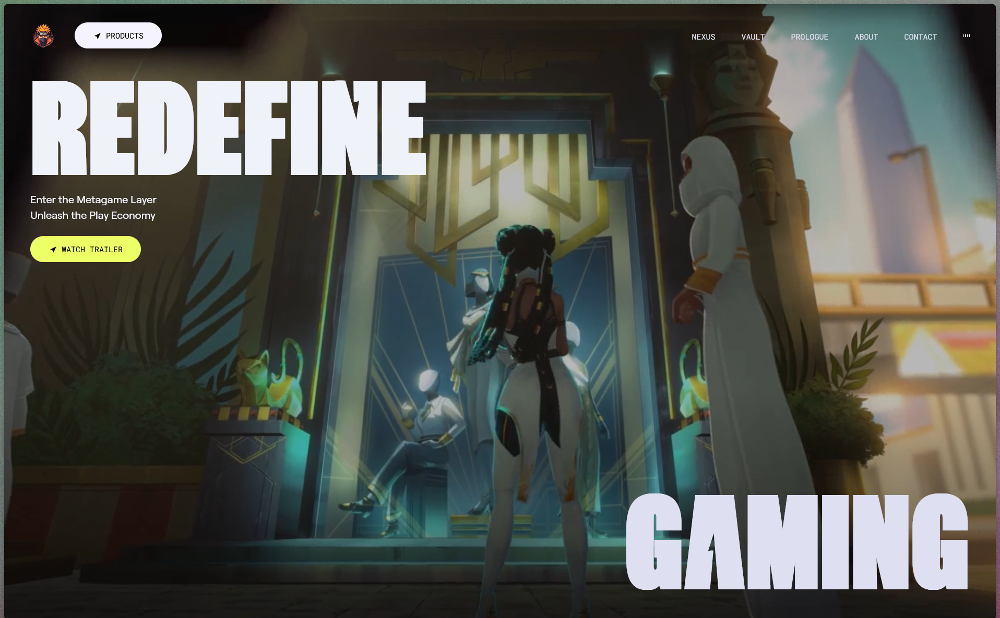
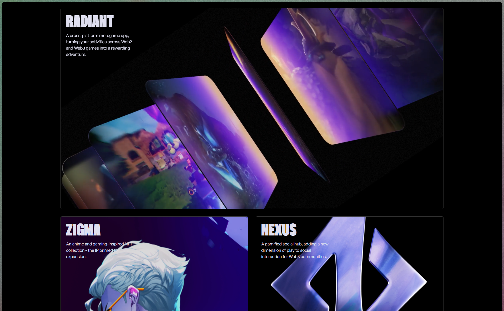

<div align="center">
  <br />
  
  <h1>🎮 ZENTRY — The Metagame Layer</h1>
  <p>
    An award-winning, immersive gaming web experience featuring smooth GSAP animations, 3D tilt micro-interactions, dynamic video transitions, and cutting-edge Bento Grid design.
  </p>

  <p>
    <a href="https://zentry-archit.vercel.app" target="_blank">
      
    </a>
  </p>

  <!-- Tech Stack Badges -->
  <p>
    
    
    
    
    
  </p>
</div>

---

## 🌐 Live Preview

Experience the live interactive animations, sound design, and 3D tilts directly in your browser:

🔗 **[https://zentry-archit.vercel.app](https://zentry-archit.vercel.app)**

---

## 📸 Showcase & Key Visuals

Here are two of the best-looking sections of the website:

### 1. 🎬 Cinematic Hero Section
*Featuring an interactive mini-video hover preview that expands into full screen with smooth GSAP clip-path morphing, custom typography, and floating background audio controls.*

<div align="center">
  
</div>

<br />

### 2. 🧊 Interactive 3D Bento Grid
*A modern multi-column bento box showcasing dynamic gaming IP videos, dynamic radial gradient cursor tracking, and 3D perspective hover-tilt effects.*

<div align="center">
  
</div>

> *Tip: Place your full-resolution screenshots inside the `screenshots/` folder as `hero.png` and `bento-grid.png`.*

---

## 🛠️ Tech Stack & Libraries

| Technology | Purpose |
| :--- | :--- |
|  **React 19** | Component-driven architecture and state management |
|  **Tailwind CSS v4** | Modern theme styling, `@utility` custom directives, and fluid responsive layouts |
|  **GSAP & ScrollTrigger** | High-performance timeline animations, scroll-bound transitions, and polygon clipping |
|  **Vite** | Lightning-fast development server and optimized production bundler |
|  **React Icons & React-Use** | Sleek iconography and responsive window scroll hooks |
|  **Vercel** | Seamless cloud continuous deployment and global CDN hosting |

---

## ✨ Features

- **Expanding Hero Video Portal**: Seamless video switching where hovering near the center reveals the next video clip, expanding into full-screen on click.
- **GSAP ScrollTrigger Polygon Morphing**: Custom `polygon()` clip paths that smoothly scale and unmask content as the user scrolls down the page.
- **3D Bento Grid Tilt Physics**: Custom mouse coordinate calculation (`perspective(700px) rotateX(...) rotateY(...)`) for realistic tactile card tilts.
- **Floating Intelligent Navbar**: Navbar that hides on scroll down, reappears with a sleek floating pill style on scroll up, and features an interactive audio frequency visualizer.
- **Prologue / Story Interactive Mask**: Cursor-interactive floating image mask using SVG filters (`#flt_tag`) and matrix transformations.
- **Custom Font System**: Hand-tuned `@font-face` integration with **Zentry**, **Circular Web**, **General Sans**, and **Robert Medium**.

---

## 💡 What I Learnt (Key Takeaways)

- **Tailwind CSS v4 `@utility` Cascade Rules**: Transitioned from legacy `tailwind.config.js` to Tailwind v4’s `@theme` and learned how custom utilities must be declared with `@utility` so responsive modifiers (`md:col-span-1`) properly override base grid styles in the CSS cascade.
- **Complex Bento Grid Layouts**: Mastered multi-row, multi-column CSS Grid spanning (`col-span` & `row-span`) to achieve asymmetrical 2/3 and 1/3 layout proportions across responsive screen breakpoints.
- **GSAP Timeline & ScrollTrigger Orchestration**: Learned how to link scrubbed timeline animations to scroll position and execute smooth `clipPath` transitions.
- **3D Transform Math & Micro-interactions**: Computed relative mouse offsets `(event.clientX - left) / width` to apply real-time 3D rotation matrix styles without lagging the render cycle.
- **Clean React Architecture**: Structured modular, reusable components (`BentoCard`, `BentoTilt`, `Button`, `AnimatedTitle`) with clean separation of concerns.

---

## 🚀 Getting Started

Follow these steps to run the project locally on your machine:

### Prerequisites
- Node.js (v18 or higher recommended)
- npm or yarn

### Installation

1. **Clone the repository:**
   ```bash
   git clone https://github.com/<your-username>/zentry-clone.git
   cd zentry-clone
   ```

2. **Install dependencies:**
   ```bash
   npm install
   ```

3. **Start the local development server:**
   ```bash
   npm run dev
   ```

4. **Build for production:**
   ```bash
   npm run build
   ```

---

## 📁 Project Structure

```text
zentry-clone/
├── public/               # Static video assets, images, and custom fonts
│   ├── audio/            # Background audio loop
│   ├── fonts/            # Zentry, Circular, General Sans, Robert
│   ├── img/              # Images, masks, and swordman visual
│   └── videos/           # Hero and Bento Grid video clips (feature-1 to feature-5)
├── screenshots/          # Showcase screenshots for README
│   ├── hero.png
│   └── bento-grid.png
├── src/
│   ├── components/       # Modular UI Components
│   │   ├── About.jsx
│   │   ├── AnimatedTitle.jsx
│   │   ├── Button.jsx
│   │   ├── Contact.jsx
│   │   ├── Features.jsx   # Bento Grid with BentoTilt & BentoCard
│   │   ├── Footer.jsx
│   │   ├── Hero.jsx       # Video portal hero section
│   │   ├── Navbar.jsx     # Floating audio-reactive navbar
│   │   ├── RoundedCorners.jsx
│   │   └── Story.jsx      # Interactive image mask story
│   ├── App.jsx           # Main application entry layout
│   ├── index.css         # Tailwind v4 @theme, custom @utility rules & fonts
│   └── main.jsx
├── .gitignore            # Git exclusion rules (node_modules, dist, env, vercel)
├── package.json
└── vite.config.js
```

---

## 📄 License

This project was built for educational and portfolio purposes, inspired by the award-winning **Zentry** website.
